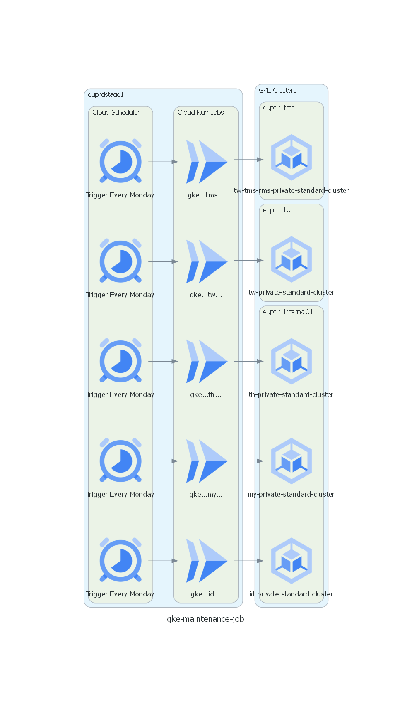

# 使用 Cloud Run 自動化 GKE 維護排除設定

## 簡介

本儲存庫提供一套自動化工具，透過 Google Cloud Run Job 排程執行 GKE（Google Kubernetes Engine）維護排除設定，用於避免 GKE 自動升級於關鍵業務時段造成的服務中斷。

本方案部署於 Google Cloud 專案 `euprdstage1`，執行時使用的服務帳號為：

- `jenkins@euprdstage1.iam.gserviceaccount.com`（執行 Cloud Run Job）
- `cloud-run@euprdstage1.iam.gserviceaccount.com`（執行 Cloud Scheduler）

## 核心功能

- 自動建構 Docker 映像並推送至 Google Artifact Registry  
- 建立並部署 Cloud Run Job 執行維護排除邏輯  
- 利用 Cloud Scheduler 定期觸發 Cloud Run Job  
- 自動計算排除時段（起始時間為當前時間，結束時間為三週後）  
- 提供模擬執行腳本供測試用途，避免修改實際環境  

## 專案結構與說明

| 檔案 / 資料夾名稱                | 功能說明                                                                 |
|------------------------------|--------------------------------------------------------------------------|
| `Dockerfile`                 | 定義執行 Cloud Run Job 所需的映像檔                                  |
| `run.sh`                     | 在 Cloud Run Job 中執行的主要邏輯，負責更新 GKE 維護排除設定              |
| `testrun.sh`                 | 模擬執行腳本，不會實際修改 GKE 狀態，便於測試與除錯                      |
| `deploy_gke_exclusion_job.sh`| 自動建構映像、部署 Cloud Run Job 並建立 Cloud Scheduler 排程              |
| `cloud_run_job_config.yaml`  | Cloud Run Job 的設定檔範例，用於 `gcloud run jobs replace` 指令部署        |
| `docker_install.sh`          | 安裝 Docker 的輔助腳本                                                   |
| `README.md`                  | 提供 IAM 權限需求與服務帳號角色建議（僅供參考）                            |

## 操作流程摘要

1. 使用 `docker_install.sh` 安裝 Docker（若尚未安裝）。
2. 執行 `deploy_gke_exclusion_job.sh` 腳本，自動完成以下步驟：
   - 驗證專案結構與檔案
   - 啟用必要的 Google Cloud API
   - 建立 Docker 映像並推送至 Artifact Registry
   - 部署 Cloud Run Job
   - 建立對應的 Cloud Scheduler 排程
3. Cloud Run Job 被 Cloud Scheduler 定期觸發後，會執行 `run.sh`，自動更新 GKE Cluster 的維護排除時段。

## 測試建議

如需測試此方案是否正確設定，可使用 `testrun.sh` 腳本模擬執行流程，觀察輸出結果，不會實際影響 GKE 環境。

